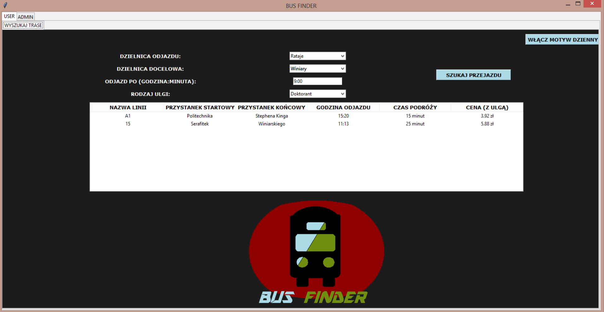
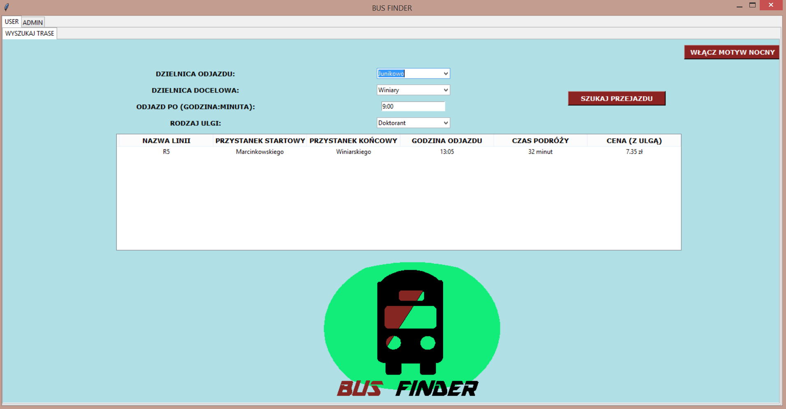
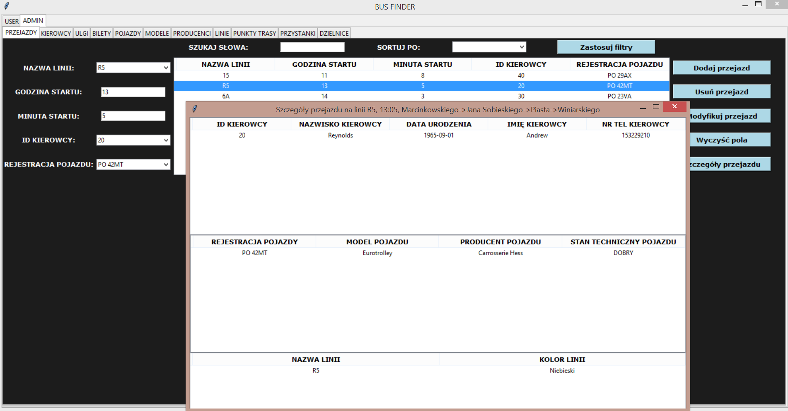
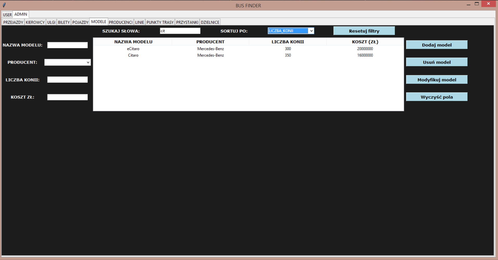

## This app is made for academic purposes and it's about a fake bus/tram company.

### The main screen consists of two tabs:

* ##### The User tab
It has only one tab where we can specify from which district we would like to depart, the target district, 
our ticket discount and the time after which we would like to depart.
All found transport connections are displayed with the information of total travel expenses (with the discount included) and the total travel time.




* ##### The Admin tab
It has as many tabs as there are tables in our schema. The admin can easily add (for example hire a new employee, add a new vehicle), delete and modify all records of chosen tabels.
The Admin can also sort records by chosen column and limit the number of displayed records by typing in keywords in the search field.
By clicking on records of more "complex" tables with multiple foreign keys, the admin can check data from other tabels referenced by these keys.




### To run the application:
1. At the beginning create the whole schema with *createAll.sql* script (it generates all tables, procedures and functions used in the application).
1. Type in console:  
    ```GUI.py```
